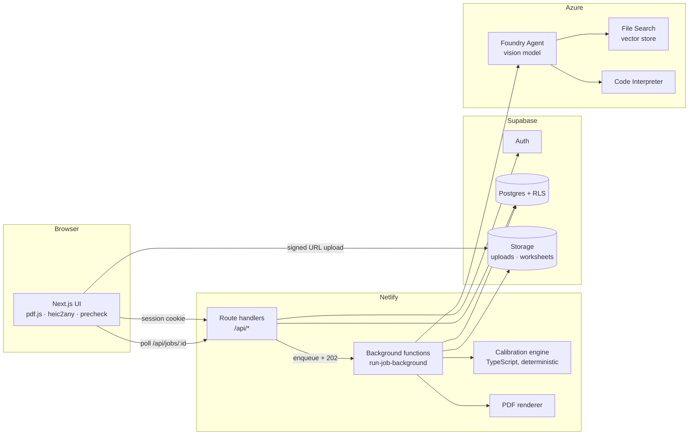
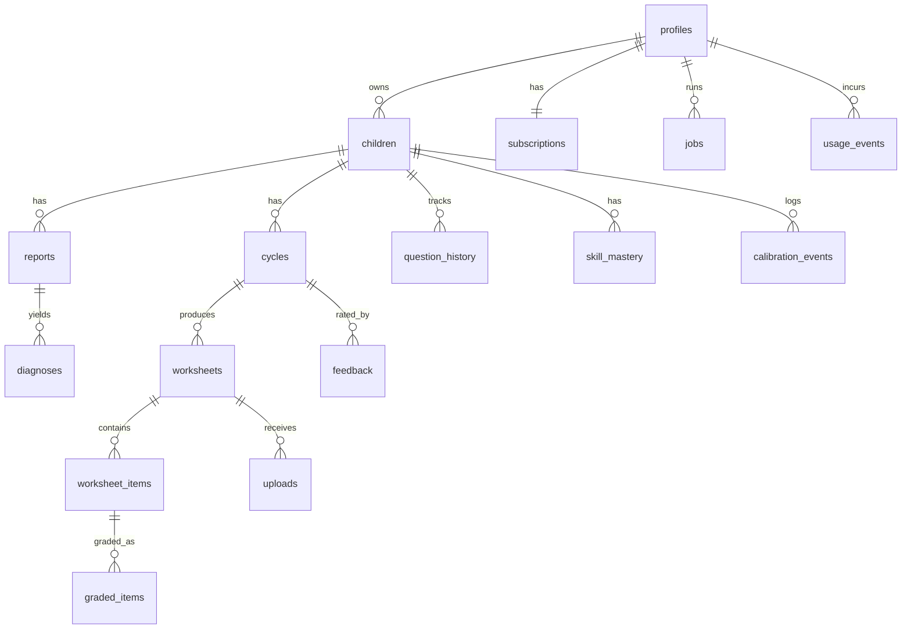

# TestReady — Engineering Document (High-Level Design)

| | |
|---|---|
| **Source PRD** | `docs/TestReady_PRD_v2.md` (v2.0, Oct 2026) |
| **Status** | Draft for approval (Stage 1 of the build workflow) |
| **Design system** | `docs/design.md` |
| **Stack (fixed)** | Next.js 14 (App Router) · Supabase (Auth, Postgres + RLS, Storage) · Azure AI Foundry Agent Service · Netlify |
| **Scope of this doc** | MVP (Phase 1) in full detail; Phase 2 and 3 at feature level |

### Confirmed architectural decisions

| # | Decision | Resolution |
|---|---|---|
| D1 | AI layer | One Azure AI Foundry agent (vision model + File Search + Code Interpreter), called **server-side only**. Connected agents deferred to v1.1 (PRD A17). The PRD component table's "OpenAI GPT-4o" reference for Component C is superseded: diagnosis runs on the Foundry agent. |
| D2 | Backend | Next.js route handlers plus Netlify Background Functions for long jobs; Supabase for Auth, Postgres and Storage. No Supabase Edge Functions. |
| D3 | Hosting | Netlify (Next.js runtime). |
| D4 | Payments | Stripe in Phase 2. MVP ships the free diagnostic and a paywall stub before the second worksheet cycle. |
| D5 | Paper size | US Letter default for US locale, A4 otherwise; parent can switch (PRD open decision 1). |
| D6 | Answer format | Free "Show your work" area plus a boxed final-answer line (PRD open decision 2). |
| D7 | PDF rendering | Server-side renderer (`@react-pdf/renderer`) for both PDFs. Code Interpreter is used for **verification only** (PRD A2 fallback), because A4/Letter fidelity is easier to guarantee and test in our own renderer. |
| D8 | Grader model | Starts on the default vision deployment; stronger model decided after the first handwriting eval (PRD open decision 4). The model name is config, not code. |

---

## 1. Executive Summary

**Project:** TestReady, a paper-first practice loop for parents of 1st and 2nd graders who have an i-Ready Math diagnostic result.

**Business goal:** Turn a confusing score into targeted practice that fixes exactly what the child got wrong, without another large subscription. Monetised through a free first diagnostic, a $29 12-week Season Pass and a $9.99/month Family plan (Phase 2).

**Problem statement:** i-Ready reports say where a child stands, not what to practise tonight. Existing alternatives (TestPrep-Online, Testing Mom, IXL) serve static or screen-based content that is not anchored to the child's own result.

**Target users:** Parents/guardians (the only logged-in users). Tutors and homeschool instructors are P2. The child never signs in or sees a screen.

**The closed loop**

1. Parent enters an i-Ready result (report preferred; overall score or placement is the minimum).
2. System maps it to syllabus concept gaps.
3. System generates a printable worksheet of fresh word problems, each tagged with an independent **math level** and **reading level**.
4. Child completes it on paper; parent photographs it.
5. System reads the handwriting, judges correctness, and recalibrates math and reading independently.

**Success criteria (from PRD Section 3)**

| Metric | Target |
|---|---|
| North Star: BOY-flagged weak domains improving ≥ 1 tier by MOY | ≥ 50% |
| Grading agreement (system vs parent-confirmed) | > 90% |
| Answer-key correctness (code-verified before release) | 100% |
| Full-loop completion (score → second worksheet) | > 60% |
| Score entry → first printable worksheet | ≤ 90 s P95 |
| Parent override rate | ≤ 10% |
| Reading-level fit | ≥ 90% of items |
| Cost per full cycle | ≤ $0.25 target, $0.50 hard cap |

---

## 2. Product Scope

### In scope (Phase 1 / MVP — PRD releases v0.1–v0.4, plus launch hardening v1.0)

- Email/password auth for adults; child profile (nickname, grade 1 or 2) (US-001)
- Intake by report (PDF/JPEG/PNG/GIF/WEBP/HEIC), overall score, or placement; optional Lexile (US-001, FR-01, FR-02)
- Parsed-value confirmation before generation (US-008, FR-03)
- Gap analysis mapped to syllabus skills with data-confidence label (US-009, FR-04)
- Student Sheet (≤ 10 questions) and separate Parent Answer Key as PDFs; Sheet ID; code-verified answers; freshness check (US-002, FR-05–FR-09)
- Photo upload, handwriting extraction, per-item confidence, parent review queue (US-003, US-004, FR-10)
- Error typing, mastery labels, deterministic recalibration of two axes (FR-11–FR-13, FR-18, US-005)
- Child Profile stored by the app and sent each call (FR-14); structured agent output (FR-15)
- Progress dashboard with plain-language reasons (US-006)
- Manual "too hard / too easy" override (US-011); read-aloud flag (FR-16)
- Child profile deletion with full data purge (FR-17)
- Disclosures on every results page (FR-19); cost guards (FR-20)
- Free diagnostic with **paywall stub** at the second cycle (US-012, stub only)
- Sibling profiles up to 3 (US-010) — data model supports it from day one; UI polish in Phase 2

### Out of scope for MVP

- Stripe checkout and subscription management (Phase 2)
- Tutor account with up to 10 children (US-007, v1.2)
- Season reminders (US-013)
- Kindergarten and Grade 3 syllabus, Spanish worksheets
- Connected multi-agent design (v1.1, only if evaluation supports it)
- Any child-facing screen
- Score prediction, diagnosis of learning difficulties, official-assessment claims
- District/school licensing

### Future enhancements

Connected agents with a stronger grader; MOY/EOY comparison reports; tutor multi-child batch generation; email reminders before test windows; native mobile capture; in-app photo capture with edge detection.

---

## 3. User Personas

| Persona | Role | Permissions | Primary workflows |
|---|---|---|---|
| **Parent / Guardian** (primary, MVP) | Authenticated adult account owner | CRUD own children, uploads, worksheets, results; confirm/override graded items; delete own data; no access to any other user's data (RLS) | Add child → enter result → confirm parsed values → read gaps → generate worksheet → print → photograph → review flagged answers → view results → next worksheet |
| **Tutor / Homeschool instructor** (P2) | Authenticated adult managing 3–10 children | Same as parent, with up to 10 children and batch generation | Weekly differentiated sheets per child |
| **Child** | Non-user | None. Never logs in or sees a screen | Writes on paper only |
| **Operator / Admin** (internal) | Team member | Supabase dashboard and Netlify/Foundry consoles only; **no in-app admin UI in MVP** | Monitor cost, override rate, drift; edit knowledge base files (Section 8) |

---

## 4. User Flows

Format: `User Action → Frontend Behavior → Backend Processing → Database Interaction → System Response`. Long AI work always goes through the **job pattern** (Section 6.4): the API returns `202 {jobId}` and the frontend polls `GET /api/jobs/:id`.

### 4.1 Sign up / log in
- **Action:** Enters email + password (sign-up also accepts consent checkbox for terms/privacy).
- **Frontend:** `react-hook-form` + zod validation; inline errors; disabled submit while pending.
- **Backend:** Supabase Auth `signUp` / `signInWithPassword` via `@supabase/ssr`; `/auth/callback` exchanges the email-confirm code for a session cookie.
- **DB:** Trigger on `auth.users` inserts a `profiles` row (default locale → paper size) and a `subscriptions` row (`plan='free'`).
- **Response:** Redirect to `/children` (empty state prompts "Add your first child").

### 4.2 Add a child (Screen 1, step 1)
- **Action:** Enters nickname + grade (1 or 2).
- **Frontend:** Helper text: "First name or nickname only."
- **Backend:** `POST /api/children`; validates length, grade, max 3 children (MVP plan cap); rejects surname-like input patterns (two words with capitals) with a soft warning, not a block.
- **DB:** Insert `children` (reading band null, `reading_band_estimated=true`).
- **Response:** Navigates to `/children/[id]/setup`.

### 4.3 Enter result: report upload (Screen 1, step 2)
- **Action:** Drops a PDF or images of the i-Ready report (≤ 5 pages, ≤ 10 MB each).
- **Frontend:** Shows a "cover the child's name" tip. PDFs are rasterised **in the browser** with `pdfjs-dist` to PNG (≤ 2000 px long edge); HEIC converted to JPEG with `heic2any`. Previews each page, allows removal.
- **Backend:** `POST /api/uploads/sign` returns signed upload URLs; browser uploads straight to the private `uploads` bucket. `POST /api/children/:id/reports` with `uploadIds` creates the `reports` row and a `parse_report` job.
- **DB:** `uploads` rows (`kind='report_page'`, `expires_at = now()+30d`), `reports` (`parse_status='pending'`), `jobs`.
- **Background:** Job downloads images, resizes with `sharp`, calls the Foundry agent in **parse mode**, validates JSON against the zod schema (one retry on invalid JSON), stores values and per-field confidence.
- **Response:** Job succeeds → Confirm screen (4.5). On failure → plain-language error + "Enter values manually".

### 4.4 Enter result: manual score or placement
- **Action:** Chooses placement (e.g. "Mid Grade 1") and/or types a scale score; optional window (BOY/MOY/EOY); optional Lexile.
- **Frontend:** Validates placement against the chosen grade (US-001: contradictory input rejected with a clear message).
- **Backend:** `POST /api/children/:id/reports` with `manual` body; no AI call, `parse_status='manual'`.
- **DB:** `reports` row, `children.lexile`/`reading_band` set via Lexile→band table (`reading_band_estimated=false`) or conservative grade-based estimate (`true`, FR-18).
- **Response:** Goes straight to 4.5.

### 4.5 Confirm parsed values (US-008, FR-03)
- **Action:** Reviews overall score, placement, domain results, window; edits any field.
- **Frontend:** Low-confidence fields highlighted and blank for manual entry. **"Continue" disabled until the parent ticks confirm.**
- **Backend:** `POST /api/reports/:id/confirm` stores `confirmed_values`, sets `confirmed_at`. Diagnosis refuses a report without `confirmed_at` (server check, not UI-only).
- **DB:** Update `reports`.
- **Response:** Automatically starts `diagnose` job and moves to Screen 2.

### 4.6 Gap analysis (Screen 2, US-009)
- **Action:** Lands on Screen 2 (or waits on a progress state).
- **Backend:** `diagnose` job calls the agent in Diagnose mode with confirmed values, grade, Child Profile and knowledge base (File Search). Output validated; every gap must carry a `skill_id` that exists in the local `skills_catalog` (Section 8.6); unmapped gaps are returned as `unmapped` and displayed as "could not map" (FR-04).
- **DB:** `diagnoses` row.
- **Response:** Summary, Key Data (with data confidence), Concept Gaps table, Strengths, Recommendations. "Likely" label when confidence is Low (score only) or Medium.

### 4.7 Generate worksheet (US-002)
- **Action:** Clicks **Generate worksheet** (focus defaults to recommended; can adjust skills).
- **Frontend:** Step indicator: reading profile → choosing skills → writing problems → verifying answers → building PDF (maps to job `progress`).
- **Backend:** `POST /api/children/:id/worksheets` → entitlement check (`canStartCycle`, 4.14) → daily cap check → creates `cycles` row (next `cycle_number`) and `generate_worksheet` job. Job pipeline:
  1. Load Child Profile, last 4 cycles of `question_history`, gaps.
  2. **Planner (app code)** builds the axis plan: per skill, which axis may change, diagnostic pairs, domain spread (Section 8.4).
  3. Agent writes items (generate mode); Code Interpreter verifies each answer.
  4. **App-side checks:** schema, count ≤ 10, ≥ 3 domains (when plan has ≥ 3), ≥ 2 diagnostic pairs, no answers on student copy, dedupe against history by hash, independent arithmetic recheck of `verification.expression`, readability band check. Failing items are replaced in a bounded repair loop (max 2 passes); unverifiable items are dropped, never shipped.
  5. Render Student Sheet and Answer Key PDFs; upload to `worksheets` bucket.
  6. Write `worksheets`, `worksheet_items`, `question_history`.
- **Response:** Preview + two download buttons (signed URLs, 15-minute expiry). Paper size toggle regenerates PDFs only (no new content).

### 4.8 Regenerate / "too hard" / "too easy" (US-011)
- **Action:** Clicks Regenerate, or marks too hard / too easy.
- **Backend:** Regenerate allowed once per cycle (`cycles.regenerations_used < 1`), increments counter, supersedes the prior worksheet (`worksheets.superseded_by`). Difficulty feedback is stored on `cycles` and logged to `calibration_events` with `source='parent_feedback'`; it influences the **next** cycle's targets only and never counts as graded evidence.

### 4.9 Upload completed sheet (Screen 3, US-003)
- **Action:** Photographs the sheet and uploads (JPEG/PNG/HEIC, ≤ 10 MB); optionally ticks "I read the questions aloud".
- **Frontend:** Capture guidance (flat, well-lit, whole page). **Client pre-check** (blur via Laplacian variance, brightness, aspect ratio) offers retake before upload. HEIC → JPEG in browser.
- **Backend:** Sign + upload as in 4.3, then `POST /api/worksheets/:id/submissions {uploadIds, readAloud}` → `grade_sheet` job.
- **Background:** Server quality gate (`sharp` stats). Rejected photos return `PHOTO_QUALITY` with retake guidance and **nothing is stored beyond the temporary upload**. Otherwise: agent in Grade mode, **two-step** (transcribe with confidence, then compare against the stored key for that Sheet ID; the key is supplied by the app from `worksheet_items`, not recalled by the model). Sheet ID read from the photo must match the worksheet; mismatch → ask to confirm; if still unknown, items are scored but skill attribution is skipped and the UI says so.
- **DB:** `uploads`, `graded_items` (system values kept immutable), `cycles.status='needs_review'` or `'grading_complete'`.
- **Response:** Item results table; flagged items go to the review queue.

### 4.10 Review queue (US-004, FR-10)
- **Action:** For each item below the confidence threshold, sees the cropped handwriting beside the extracted value ("Is this 12 or 17?") and taps confirm or edits the value / correctness.
- **Backend:** `POST /api/graded-items/:id/confirm`. The crop is produced during grading (bounding box → `sharp` extract) and stored in the private bucket. Parent value wins; original system value is retained.
- **DB:** `graded_items.parent_confirmed=true`, `parent_answer`, `final_status`, `confirmed_at`. Skipped items stay `parent_confirmed=false` and are **excluded** from mastery updates.
- **Response:** Queue count decreases; "Finish" enabled when empty or the parent chooses "skip remaining".

### 4.11 Results and recalibration (US-005, FR-12, FR-13)
- **Action:** Clicks **Finish review** (`POST /api/cycles/:id/finalize`).
- **Backend:** `recalibrate` job. (a) Model returns error types and rationale text for confirmed wrong items only; (b) **deterministic calibration engine** (TypeScript, no model call) computes mastery labels and level changes (Section 8.5); (c) a second small model call (or template) writes the plain-language "why difficulty moved" text from the engine's structured output.
- **DB:** Upserts `skill_mastery`, `reading_state` fields on `children`, inserts `calibration_events`, closes the `cycles` row.
- **Response:** Summary, Item Results, Mastery by Skill (Secure / Developing / Not yet / Not enough evidence), Reading-vs-Math read-out, Calibration Update, Recommendations, Next Step, and the permanent disclosure (FR-19).

### 4.12 Progress dashboard (US-006)
- **Action:** Opens Progress tab.
- **Backend:** `GET /api/children/:id/progress` reads `cycles`, `skill_mastery`, `calibration_events`, grouped by i-Ready domain names. No AI.
- **Response:** Per-domain trend across cycles, per-skill status, and one plain-language reason per change. Language is "still building", never "weak".

### 4.13 Delete child (FR-17)
- **Action:** Settings → Delete profile → typed confirmation.
- **Backend:** `DELETE /api/children/:id` runs a deletion job: removes all Storage objects under `{user_id}/{child_id}/`, then deletes the `children` row; every child-scoped table cascades. Writes a non-identifying `usage_events` row (`child_deleted`) for cost accounting.
- **Response:** Confirmation; the child no longer appears; no recovery.

### 4.14 Free diagnostic and paywall stub (US-012)
- **Action:** Tries to start cycle 2 (second worksheet).
- **Backend:** `canStartCycle(userId)` reads `subscriptions`. MVP rule: `plan='free'` → one gap analysis, one worksheet, one graded upload per **household** (user). A second cycle returns `402 PAYWALL`.
- **Frontend:** Paywall page shows the plans and a waitlist/"notify me" capture (stored in `subscriptions.waitlist_opt_in`). In Phase 2 this page becomes Stripe Checkout.

### 4.15 Failure and retry
Any job failure shows a plain-language message with **Try again** (re-enqueues the same job, bounded by `jobs.attempts ≤ 3`) and, where possible, the last generated worksheet stays downloadable. No silent failures.

---

## 5. Frontend Architecture

### 5.1 Stack

| Concern | Choice | Notes |
|---|---|---|
| Framework | Next.js 14, App Router, TypeScript strict | Server Components for data pages; Client Components for forms and uploads |
| Styling | Tailwind CSS with CSS custom properties generated from `docs/design.md` tokens | All colours, spacing, type and radii from the design system; no arbitrary values |
| Components | shadcn/ui primitives (Radix) restyled with design tokens | Accessible by default |
| Server state | TanStack Query | Job polling, progress, results |
| Client state | Zustand (intake wizard draft only) | Draft survives refresh via `sessionStorage` (no sensitive data) |
| Forms | `react-hook-form` + `zod` | Same zod schemas shared with route handlers (`src/lib/schemas`) |
| PDF → PNG | `pdfjs-dist` in a web worker | PRD A4/FR-02; keeps PDF handling off the server |
| HEIC | `heic2any` (lazy loaded) | iPhone photos |
| Image pre-check | Canvas-based blur/brightness check | Reduces bad grading attempts |
| Auth client | `@supabase/ssr` | Cookie sessions; middleware refreshes tokens |
| Analytics | Event helper `track()` writing to `usage_events` plus an optional product analytics adapter | Funnel: score → print → upload → next sheet |

### 5.2 Routing

```
/                              Marketing / landing (static)
/login, /signup                Auth
/auth/callback                 Supabase code exchange
/children                      Child list (up to 3) + add
/children/[childId]/setup      Screen 1 — enter results and confirm
/children/[childId]/plan       Screen 2 — gaps + worksheet
/children/[childId]/results    Screen 3 — upload, review, results
/children/[childId]/progress   Progress dashboard
/children/[childId]/settings   Paper size, delete profile
/pricing                       Plans + paywall stub
/privacy, /terms, /trust       Static policy pages
```

The PRD's "three screens" are implemented as three route steps with a persistent stepper; the dashboard and settings are tabs on the same child shell layout.

### 5.3 Component hierarchy

```
RootLayout
├─ AuthGuard (middleware + server check)
└─ AppShell
   ├─ Header (ChildSwitcher, Account menu)
   └─ ChildLayout [childId]
      ├─ Stepper (Setup · Plan · Results · Progress)
      ├─ SetupPage
      │  ├─ ChildForm
      │  ├─ ResultInput (Tabs: Report | Score/Placement)
      │  │  ├─ ReportDropzone → PageThumbnails
      │  │  └─ ManualScoreForm (PlacementSelect, ScoreInput, WindowSelect, LexileInput)
      │  └─ ParsedValuesConfirm (FieldRow × n, ConfidenceBadge, ConfirmCheckbox)
      ├─ PlanPage
      │  ├─ GapSummary, KeyDataCard, ConceptGapsTable (SkillTag, PriorityBadge)
      │  ├─ StrengthsList, RecommendationsList
      │  ├─ FocusPicker
      │  ├─ GenerateButton → JobProgress (steps)
      │  └─ WorksheetPreview (PaperSizeToggle, DownloadButtons, RegenerateButton, DifficultyFeedback)
      ├─ ResultsPage
      │  ├─ PhotoCapture (guidance, quality precheck, ReadAloudToggle)
      │  ├─ ReviewQueue (ReviewCard: CropImage + ExtractedValue + ConfirmEdit)
      │  ├─ ItemResultsTable, MasteryBySkill (StatusBadge)
      │  ├─ ReadingVsMathReadout, CalibrationUpdate
      │  └─ DisclosureBanner (always rendered)
      └─ ProgressPage (DomainTrendChart, SkillTimeline, ChangeReasonList)
```

### 5.4 UX states (every data-driven component)

| State | Behaviour |
|---|---|
| Loading | Skeletons for pages; named step progress for jobs (never a bare spinner > 3 s) |
| Empty | Friendly prompts: "No children yet", "No worksheets yet — generate your first" |
| Error | Plain-language message, code-mapped (e.g. `PHOTO_QUALITY` → retake guidance), **Try again**, and manual-entry fallbacks |
| Partial | Unconfirmed items shown as "not counted yet" |
| Responsive | Mobile-first (parents photograph with a phone); breakpoints from the design system; print-friendly stylesheet for the preview |
| Accessibility | WCAG 2.1 AA: labelled inputs, focus order, 4.5:1 contrast, keyboard operable dropzone, live regions for job progress, no colour-only status (badges carry text), `prefers-reduced-motion` honoured |
| Tone | "Still building", "next step"; never "weak" or "behind" |

---

## 6. Backend Architecture

### 6.1 Stack

| Layer | Technology |
|---|---|
| API | Next.js route handlers (`src/app/api/**/route.ts`), Node runtime |
| Long jobs | Netlify Background Functions (`netlify/functions/*-background.ts`), up to 15 min |
| Database / Auth / Storage | Supabase (Postgres 15, Auth, Storage) |
| AI | Azure AI Foundry Agent Service via `@azure/ai-projects` + `@azure/identity` (service principal) |
| Validation | zod, shared with the frontend |
| Image / PDF | `sharp` (resize, crop, quality), `@react-pdf/renderer` (PDFs) |
| Arithmetic recheck | `mathjs` with a restricted scope (numbers and `+ - * / ( )` only) |
| Logging | Structured JSON logs (`pino`); request ID on every log line |

### 6.2 Core systems

| System | Design |
|---|---|
| **Authentication** | Supabase Auth, email/password, cookie sessions. Middleware refreshes tokens and redirects unauthenticated users. |
| **Authorization** | Postgres RLS is the source of truth (`user_id = auth.uid()` directly or via `children`). Route handlers use the **user-scoped** Supabase client; only background jobs and deletion use the service-role client, and they always re-assert ownership from the `jobs.user_id`. |
| **Business logic** | `src/lib/*` services: `children`, `reports`, `diagnosis`, `worksheets`, `grading`, `calibration`, `entitlements`, `usage`. Route handlers are thin. |
| **Validation** | Every request body, query and agent response is parsed by a zod schema; unknown fields rejected. |
| **Middleware** | `withAuth` → `withRateLimit` → `withValidation` composition for handlers; request ID injection. |
| **Error handling** | Typed `AppError(code, httpStatus, userMessage)`; single envelope `{ "error": { "code", "message", "details?" } }`. Foundry/Supabase errors mapped to stable codes; raw provider messages never reach the client. |
| **Retries** | Foundry calls: 3 attempts, exponential backoff with jitter on 429/5xx; idempotency by `jobs.id`. |
| **Cost guards** | Per-call max output tokens; regenerations capped; daily cycle cap per user; usage events summed per day; alert at 80% of budget (Section 8.7). |
| **Secrets** | Foundry credentials, Supabase service-role key and job secret exist only in Netlify server env. Never in the browser bundle. |

### 6.3 Service interaction diagram



### 6.4 Job pattern (required by Netlify limits)

Synchronous Netlify functions time out far below the PRD's 90-second generation budget (the current limit should be confirmed at build time; plan on ~26 s at most). Therefore:

1. Route handler validates, checks entitlement and caps, inserts a `jobs` row (`queued`), then calls `POST /.netlify/functions/run-job-background` with `{jobId}` and an HMAC header (`JOB_SIGNING_SECRET`). Returns `202 {jobId}` in < 1 s.
2. The background function loads the job, sets `running`, executes the typed pipeline for `jobs.type`, writes progress (`jobs.progress` step name + percent), then `succeeded` or `failed`.
3. The browser polls `GET /api/jobs/:id` every 2 s (back-off to 5 s) while the tab is visible. Supabase Realtime on `jobs` is an optional later upgrade.
4. Stuck jobs (`running` > 10 min) are flipped to `failed` by a scheduled function (`reap-stale-jobs`, runs every 5 min) so users never wait forever.

```mermaid
sequenceDiagram
  participant B as Browser
  participant A as Route handler
  participant J as Background function
  participant D as Supabase DB
  participant F as Foundry agent
  B->>A: POST /api/children/:id/worksheets
  A->>D: check entitlement, caps; insert cycle + job(queued)
  A->>J: trigger (HMAC)
  A-->>B: 202 { jobId }
  J->>D: job → running; load profile + history
  J->>F: generate mode (File Search + Code Interpreter)
  F-->>J: items JSON + verification
  J->>J: app-side checks, dedupe, readability, recompute
  J->>J: render Student + Key PDFs
  J->>D: store worksheet, items, history; job → succeeded
  loop every 2s
    B->>A: GET /api/jobs/:id
    A-->>B: status, progress
  end
```

---

## 7. Database Design and Schema

PostgreSQL via Supabase. All tables: `id uuid primary key default gen_random_uuid()`, `created_at timestamptz not null default now()` unless stated. Enums are Postgres enums. **Every table has RLS enabled.** Child-scoped tables use the policy pattern:

```sql
using (exists (select 1 from children c where c.id = <table>.child_id and c.user_id = auth.uid()))
```

Service-role access is limited to background jobs and deletion. The full runnable SQL is produced in Stage 2 (`docs/specs/supabase-schema.sql`).

### 7.1 Entity relationships



### 7.2 Tables

**`profiles`** — one per auth user.
| Column | Type | Constraints |
|---|---|---|
| id | uuid | PK, FK → `auth.users(id)` on delete cascade |
| email | text | not null |
| paper_size | enum(`letter`,`a4`) | not null default `letter` |
| locale | text | default `en-US` |
| terms_accepted_at | timestamptz | |
Indexes: PK only. RLS: select/update own row.

**`subscriptions`** — entitlement state (stub in MVP, Stripe fields in Phase 2).
| Column | Type | Constraints |
|---|---|---|
| user_id | uuid | PK, FK → profiles |
| plan | enum(`free`,`season`,`family`,`tutor`) | default `free` |
| status | enum(`active`,`past_due`,`canceled`,`none`) | default `none` |
| free_cycle_used | boolean | default false |
| waitlist_opt_in | boolean | default false |
| child_limit | smallint | default 3 |
| daily_cycle_cap | smallint | default 3 |
| stripe_customer_id, stripe_subscription_id | text | nullable, Phase 2 |
| current_period_end | timestamptz | nullable |
RLS: select own; **writes only by service role** (webhook).

**`children`**
| Column | Type | Constraints |
|---|---|---|
| user_id | uuid | not null FK → profiles, on delete cascade |
| nickname | text | not null, check `char_length between 1 and 30` |
| grade | smallint | not null, check `grade in (1,2)` |
| lexile | integer | nullable, check 0–1500 |
| reading_band | text | check in (`R1`,`R2`,`R3`,`R4`) |
| reading_band_estimated | boolean | not null default true |
| reading_confidence | enum(`low`,`med`,`high`) | default `low` |
| current_cycle | integer | not null default 0 |
| profile_summary | jsonb | cached Child Profile payload (rebuilt each cycle) |
Constraint: unique `(user_id, nickname)`. Index: `(user_id)`. Trigger enforces the plan's `child_limit`.

**`reports`**
| Column | Type | Constraints |
|---|---|---|
| child_id | uuid | FK → children on delete cascade |
| source | enum(`upload`,`manual`) | not null |
| window | enum(`BOY`,`MOY`,`EOY`) | nullable |
| overall_score | integer | nullable |
| placement | text | nullable |
| domain_results | jsonb | nullable |
| field_confidence | jsonb | nullable |
| parsed_values | jsonb | raw agent output, immutable |
| confirmed_values | jsonb | parent-confirmed |
| confirmed_at | timestamptz | nullable; **diagnosis requires non-null** |
| parse_status | enum(`pending`,`parsed`,`manual`,`failed`) | |
Check: at least one of `overall_score`, `placement`, `domain_results` present in `confirmed_values` before confirm. Index `(child_id, created_at desc)`.

**`diagnoses`**
| Column | Type |
|---|---|
| child_id, report_id | uuid FKs |
| data_confidence | enum(`high`,`medium`,`low`) |
| summary | text |
| gaps | jsonb (array of `{domain, skill_id, evidence, gap_level, priority, likely}`) |
| strengths, recommendations | jsonb |
| unmapped_items | jsonb |
| kb_version, prompt_version, model | text |
Index `(child_id, created_at desc)`.

**`cycles`**
| Column | Type | Constraints |
|---|---|---|
| child_id | uuid | FK |
| cycle_number | integer | not null; unique `(child_id, cycle_number)` |
| diagnosis_id | uuid | FK |
| status | enum(`planned`,`generating`,`ready`,`grading`,`needs_review`,`graded`,`complete`,`failed`) | |
| focus | jsonb | chosen skills and axis plan |
| regenerations_used | smallint | default 0, check ≤ 1 |
| parent_difficulty_feedback | enum(`too_hard`,`too_easy`) | nullable |
| read_aloud | boolean | default false |
| summary, calibration_text | text | |
| completed_at | timestamptz | |

**`worksheets`**
| Column | Type | Constraints |
|---|---|---|
| cycle_id, child_id | uuid | FKs |
| sheet_id | text | **unique**, format `TR-<nick>-C<n>-<4chars>` |
| version | smallint | default 1 |
| superseded_by | uuid | nullable self-FK |
| paper_size | enum | |
| student_pdf_path, key_pdf_path | text | Storage paths |
| prompt_version, model, kb_version | text | |
| verified_at | timestamptz | **set only after every item passes verification** |
RLS ensures PDFs are only reachable through signed URLs.

**`worksheet_items`**
| Column | Type | Constraints |
|---|---|---|
| worksheet_id | uuid | FK on delete cascade |
| position | smallint | 1–10, unique `(worksheet_id, position)` |
| skill_id | text | not null, validated against `skills_catalog` |
| domain | text | |
| math_level | smallint | 1–4 |
| reading_band | text | R1–R4 |
| pair_id | text | nullable; shared by a diagnostic pair |
| structure | text | join, separate, compare, part-part-whole, missing addend, equal groups, … |
| context | text | |
| number_set | jsonb | |
| question_text | text | |
| answer_type | enum(`integer`,`text`,`choice`) | |
| correct_answer | text | |
| working | text | worked solution (key only) |
| verification | jsonb | `{expression, expected, passed, method}` |
| is_stretch | boolean | |
| question_hash | text | normalised hash for dedupe |
| key_flagged_wrong | boolean | default false; parent flag excludes item from calibration |
Index `(worksheet_id)`, `(question_hash)`.

**`question_history`**
| Column | Type |
|---|---|
| child_id | uuid FK |
| cycle_number | integer |
| skill_id, structure, context | text |
| number_set | jsonb |
| question_hash | text |
Unique `(child_id, question_hash)`; index `(child_id, cycle_number desc)`. Dedupe rule (FR-08): no repeated hash, number set, or `context+structure` within the last 4 cycles.

**`uploads`**
| Column | Type | Notes |
|---|---|---|
| user_id, child_id | uuid | |
| kind | enum(`report_page`,`completed_sheet`,`item_crop`) | |
| report_id, worksheet_id | uuid | nullable FKs |
| storage_path | text | `{user_id}/{child_id}/{kind}/{uuid}.{ext}` |
| mime, bytes, page_no | | check `bytes ≤ 10485760` |
| quality_score | numeric | |
| expires_at | timestamptz | default `now() + interval '30 days'` |
| deleted_at | timestamptz | |

**`graded_items`**
| Column | Type | Notes |
|---|---|---|
| worksheet_item_id | uuid | FK |
| cycle_id | uuid | FK |
| upload_id | uuid | FK |
| extracted_answer | text | |
| extraction_confidence | numeric(3,2) | 0–1 |
| system_status | enum(`correct`,`partial`,`incorrect`,`blank`) | immutable |
| error_type | enum(`calculation_slip`,`concept_gap`,`reading_difficulty`,`attention_copying`,`unclear`) | |
| method_evidence | text | |
| needs_review | boolean | `confidence < threshold` |
| crop_path | text | |
| parent_confirmed | boolean | default false |
| parent_answer | text | |
| final_status | enum | set on confirm; null while unconfirmed |
| overridden | boolean | `final_status != system_status` |
| confirmed_at | timestamptz | |
Unique `(worksheet_item_id, upload_id)`. Index `(cycle_id, needs_review)`.

**`skill_mastery`**
| Column | Type |
|---|---|
| child_id | uuid FK |
| skill_id | text |
| math_level | smallint 1–4 |
| status | enum(`secure`,`developing`,`not_yet`,`not_enough_evidence`) |
| evidence_count, secure_cycles, not_yet_cycles | integer |
| last_seen_cycle | integer |
| trend | enum(`improving`,`steady`,`slipping`) |
| manual_override | boolean |
Unique `(child_id, skill_id)`.

**`calibration_events`** — transparency log feeding the dashboard.
| Column | Type |
|---|---|
| child_id, cycle_id | uuid |
| axis | enum(`math`,`reading`) |
| skill_id | text, nullable (reading axis is child-level) |
| from_level, to_level | text |
| reason | text (plain language) |
| source | enum(`rules`,`parent_override`,`parent_feedback`,`baseline_reset`) |

**`feedback`**: `cycle_id`, `worksheet_id`, `user_id`, `rating smallint 1–5`, `comment text`.

**`jobs`**
| Column | Type |
|---|---|
| user_id, child_id | uuid |
| type | enum(`parse_report`,`diagnose`,`generate_worksheet`,`grade_sheet`,`recalibrate`,`delete_child`) |
| status | enum(`queued`,`running`,`succeeded`,`failed`) |
| progress | jsonb `{step, percent}` |
| input, result | jsonb |
| error_code, error_message | text |
| attempts | smallint (≤ 3) |
| started_at, finished_at | timestamptz |
Index `(user_id, created_at desc)`, `(status, started_at)` for the reaper.

**`usage_events`**: `user_id`, `child_id` (nullable, no FK so deletion keeps cost history), `job_id`, `event` (text), `input_tokens`, `output_tokens`, `est_cost_usd numeric(8,4)`. Index `(user_id, created_at)` for the daily cap and cost alerts.

**`skills_catalog`** (reference data, read-only to users): `skill_id text PK`, `grade`, `domain`, `name`, `prerequisites text[]`, `levels jsonb`. Seeded from the knowledge-base syllabus files so the app can reject agent output that cites a skill outside the catalogue.

### 7.3 Storage buckets (private)

| Bucket | Contents | Access | Retention |
|---|---|---|---|
| `uploads` | Report pages, completed-sheet photos, item crops | Owner-only RLS on `storage.objects` by path prefix `{user_id}/` | Deleted 30 days after upload (scheduled function `purge-expired-uploads`, daily) or on parent request |
| `worksheets` | Student Sheet and Answer Key PDFs | Owner-only; signed URL, 15 min expiry | Kept until the child is deleted |

---

## 8. AI Architecture

### 8.1 Provider and components

| Item | Decision |
|---|---|
| Provider | Azure AI Foundry Agent Service |
| Agent | **One** agent `testready-agent` (v1.1: orchestrator + `diagnostic`, `worksheet`, `grader`) |
| Model | Vision-capable GPT-4.1 / GPT-4o class deployment; name in env `FOUNDRY_MODEL_DEPLOYMENT`; separate `FOUNDRY_GRADER_DEPLOYMENT` allows swapping the grader |
| Tools | **File Search** (vector store `testready-kb`) and **Code Interpreter** |
| Where called | Only from background functions; never from the browser |
| Statefulness | Each call creates a fresh thread; the app sends the Child Profile every time (FR-14). Threads are deleted after the run. |

### 8.2 Knowledge base (grounding)

Files attached to the vector store, versioned in the repo under `kb/` and uploaded by a script (`scripts/sync-kb.ts`):

`syllabus_grade1.md`, `syllabus_grade2.md`, `sample_questions.md`, `iready_interpretation.md` (includes the Lexile → R-band table), optional `worksheet_template.md`. The `kb_version` (git hash of `kb/`) is stored on every diagnosis and worksheet. Missing facts must be declared by the agent and labelled as estimates (PRD s7).

### 8.3 Prompt strategy

Instruction text lives in `prompts/` and is **versioned** (`prompts/v1.0/…`); the agent instruction is the PRD-referenced `TestReady-Foundry-Instructions.md` content, split into one **system block** plus a **mode block** chosen per call. No ad-hoc portal edits.

| Mode | Technique | Temp | Max output tokens | Output |
|---|---|---|---|---|
| `parse` | Zero-shot + schema + 2–3 few-shot report layouts | 0.1 | 1,500 | Report JSON with per-field confidence |
| `diagnose` | Grounded retrieval + prerequisite-order rules | 0.2 | 1,500 | Summary, Key Data, Gaps, Strengths, Recommendations |
| `generate` | Few-shot from `sample_questions.md`; explicit dual-axis spec; band constraints injected per item | 0.6 (wording), key fields deterministic | 4,000 | Items JSON + Code Interpreter verification |
| `grade` | Two-step: transcribe with confidence, then compare to supplied key | 0.1 | 2,500 | Per-item extraction, status, error type, evidence |
| `explain` | Template-assisted | 0.3 | 600 | Plain-language "why difficulty moved" |

**Input contract** (JSON in the user message; the frontend enforces required fields, the agent only flags surprises): `mode`, `grade`, `score_or_placement`, `report_images[]`, `lexile`, `child_nickname`, `child_profile`, `question_history_summary`, `axis_plan`, `sheet_key` (grade mode).

**Output contract:** every mode returns the five-part structure (Summary, Key Data, Gaps/Results, Recommendations, Next Step) **plus** a JSON block validated by a zod schema (FR-15). Invalid JSON → one automatic retry with "Return only the JSON"; second failure → job fails with a retryable error.

### 8.4 Worksheet generation design

- **Axis plan (app code, before the model):** for each target skill, choose `math_level` and `reading_band` from the Child Profile and ensure that **no skill raises both axes in the same cycle** (FR-06). The plan fixes: 10 items max; ≥ 3 domains where the gap plan allows; ~60–70% gap items, 20–30% near-mastery items, 1–2 stretch/review; ≥ 2 diagnostic pairs (same skill and level, lower vs target reading band); easy opener, ascending difficulty (FR-05).
- **Model fills the plan:** it writes wording and numbers within the plan; it does not decide levels.
- **Verification layers (FR-07):** (1) Code Interpreter recomputes each answer in-run; (2) the app independently re-evaluates `verification.expression` with `mathjs` and compares; (3) a rule checks "exactly one defensible answer" (answer type + no ambiguity flag from the model). Any item failing a layer is replaced; `worksheets.verified_at` is set only when all items pass. **A worksheet without `verified_at` is never shown.**
- **Readability check:** deterministic metrics (sentence count, words per sentence, syllable and sight-word heuristics) per band from `bands.ts`; out-of-band items are rewritten (max 2 passes).
- **Freshness (FR-08):** hash `normalise(question_text)`, number set and `context+structure`; query the last 4 cycles of `question_history`; collision → regenerate that item.
- **Safety of content:** age-appropriate, culturally neutral names and settings; a small denylist plus model self-check.
- **Sheet ID:** generated by the app (`TR-<nick>-C<cycle>-<4 chars>`), not the model.

### 8.5 Calibration engine (deterministic, TypeScript — Component F)

The model supplies error classification and rationale text only; level changes are computed in `src/lib/calibration/`.

**Inputs:** confirmed `graded_items`, `worksheet_items` metadata, `skill_mastery`, reading state, `read_aloud` flag. Excluded from all updates: unconfirmed items, `key_flagged_wrong` items, items with `error_type='unclear'` for attribution (but still counted as evidence for correctness).

**Mastery labels (FR-12):** Secure = ≥ 2 correct with sound method (or 1 plus strong prior history); Not yet = ≥ 2 incorrect with a consistent error pattern; Developing = mixed; Not enough evidence = 1 item or unconfirmed.

**Math axis (per skill):**
- Up one level after Secure at the current level on 2 separate cycles, or on ≥ 2 items in one cycle with sound method.
- Hold when Developing or insufficient.
- Down one level after Not yet on 2 cycles or a clear concept gap; schedule a prerequisite re-test.
- Maximum one step per skill per cycle; decay check re-tests a skill after ≥ 3 cycles without evidence.

**Reading axis (child level):** uses only reading-attributable evidence: diagnostic pairs where the lower-R item is right and the target-R item is wrong, reading-difficulty error types, and parent-reported behaviour. Up when higher-R items are correct at known-secure skills across 2 cycles; down when reading-attributable errors repeat at the band. Read-aloud items are excluded. New Lexile data resets the anchor (`calibration_events.source='baseline_reset'`). Reading confidence rises with repeated paired evidence.

**Parent feedback:** "too hard / too easy" shifts the next cycle's target by half a step (affects selection of items within a level), is logged separately, and never counts as graded evidence.

The engine is a pure function `(state, evidence) → {newState, events[]}` so it is exhaustively unit-testable and property-testable (Section 13).

### 8.6 Hallucination and grounding controls (PRD s9 mapped to enforcement points)

| Risk | Control | Enforced in |
|---|---|---|
| Wrong answer key | Three-layer verification; `verified_at` gate | `worksheets` service |
| Fabricated standard/skill | `skill_id` must exist in `skills_catalog`; otherwise `unmapped` | zod refine + DB FK-style check |
| Invented cut-offs | Missing KB facts → labelled estimate and parent confirmation | Prompt + UI label |
| Misread digit | Per-item confidence; below threshold → review queue; no mastery update until confirmed | `grading` service + calibration filter |
| Misread report | Parent confirmation gate; `confirmed_at` required | Route + service |
| Blurry photo | Client precheck + server quality gate | `uploads` service |
| Over-claiming | Disclosure on every results page (FR-19), no score predictions, copy review | UI component `DisclosureBanner` |
| Single item overrates mastery | Evidence thresholds in the engine | `calibration` |

The extraction-confidence threshold is a config value (default **0.85**, an assumption to tune from the calibration curve in the eval suite).

### 8.7 Limits, rate limiting and cost control

| Control | Value |
|---|---|
| Max output tokens | Per mode, see 8.3 |
| Regeneration | 1 per cycle (FR-20) |
| Daily cycle cap | `subscriptions.daily_cycle_cap` (default 3 per user per day) |
| API rate limits | Per-IP and per-user token bucket on `/api/*` mutations (Upstash Redis or Postgres counters); stricter on upload signing and job creation |
| Concurrency | Max 2 running jobs per user; global queue depth alert |
| Upload limits | 10 MB per image; report ≤ 5 pages; allowed MIME list enforced on sign and on server read |
| Cost tracking | Every model call writes `usage_events` (tokens, estimated cost); rolling-7-day average per cycle |
| Alerts | Cost per cycle > $0.35 (7-day rolling), spend ≥ 80% of monthly budget, override rate > 10% in any 7 days |

### 8.8 Fallbacks and failure handling

| Failure | Behaviour |
|---|---|
| Foundry 429/5xx/timeout | 3 retries with backoff; then job `failed` with "Try again"; last worksheet stays downloadable |
| Invalid JSON | One corrective retry, then fail |
| Report unreadable | Offer manual entry (always available) |
| Verification fails repeatedly | Fewer than 10 items allowed if ≥ 6 verified items cover ≥ 3 domains (or all gap domains); otherwise fail with retry. Never ship an unverified item. |
| Model deprecation | Deployment names in env config; full eval suite must pass before a swap |
| Knowledge base gap | Agent states the gap, gives labelled estimate |

### 8.9 Privacy in AI calls

Only nickname, grade, scores and images are sent. The upload guidance asks parents to cover the child's name field. No parent or child data is used for training (Azure data-handling settings confirmed during setup). Images are deleted from Storage after 30 days, or on request.

---

## 9. API Specification

**Conventions**
- Base path `/api`. JSON bodies, `Content-Type: application/json` unless noted.
- Auth: Supabase session cookie. All routes except `/api/stripe/webhook` require it. Unauthenticated → `401 UNAUTHENTICATED`.
- Every id in a path is verified against ownership via RLS; non-owned or missing → `404 NOT_FOUND` (never `403`, to avoid leaking existence).
- Error envelope: `{ "error": { "code": "VALIDATION_ERROR", "message": "…", "details": { … } } }`.
- Async endpoints return `202 { "jobId": "uuid" }`.
- Common errors: `400 VALIDATION_ERROR`, `401 UNAUTHENTICATED`, `404 NOT_FOUND`, `409 CONFLICT`, `413 FILE_TOO_LARGE`, `415 UNSUPPORTED_MEDIA`, `422 UNPROCESSABLE`, `429 RATE_LIMITED`, `402 PAYWALL`, `500 INTERNAL`.

### 9.1 Children

| Method & path | Purpose | Request | Response | Validation / errors |
|---|---|---|---|---|
| `GET /api/children` | List own children | — | `200 { children: Child[] }` | — |
| `POST /api/children` | Create child | `{ nickname: string(1–30), grade: 1\|2 }` | `201 Child` | nickname trimmed; `409 CHILD_EXISTS`; `422 CHILD_LIMIT` when plan limit reached |
| `GET /api/children/:childId` | Get child + Child Profile summary | — | `200 Child` | `404` |
| `PATCH /api/children/:childId` | Update nickname, grade, Lexile, paper size | partial of `{ nickname, grade, lexile: int 0–1500\|null }` | `200 Child` | Changing grade after cycles exist → `409 GRADE_LOCKED` |
| `DELETE /api/children/:childId` | Delete child and all data (FR-17) | `{ confirm: "<nickname>" }` | `202 { jobId }` | Mismatch → `400`; irreversible |

### 9.2 Uploads

| Method & path | Purpose | Request | Response | Validation / errors |
|---|---|---|---|---|
| `POST /api/uploads/sign` | Get signed upload URLs | `{ childId, kind: "report_page"\|"completed_sheet", files: [{ name, mime, bytes }] }` (≤ 5 files report, ≤ 4 sheet) | `200 { uploads: [{ uploadId, uploadUrl, path }] }` | MIME in `image/png,jpeg,webp,gif,heic`; `bytes ≤ 10 MB`; `415`, `413` |
| `GET /api/uploads/:uploadId/url` | Short-lived read URL (crop/preview) | — | `200 { url, expiresAt }` | owner only |
| `DELETE /api/uploads/:uploadId` | Delete an upload now | — | `204` | |

### 9.3 Reports and diagnosis

| Method & path | Purpose | Request | Response | Validation / errors |
|---|---|---|---|---|
| `POST /api/children/:childId/reports` | Create report from uploads (parse job) or manual values | `{ uploadIds: uuid[] }` **or** `{ manual: { overallScore?: int, placement?: string, window?: "BOY"\|"MOY"\|"EOY", lexile?: int } }` | upload: `202 { jobId, reportId }`; manual: `201 Report` | ≥ 1 of score/placement/report; placement must match the child's grade; `422 CONTRADICTORY_INPUT` |
| `GET /api/reports/:reportId` | Parsed + confirmed values | — | `200 Report` | |
| `POST /api/reports/:reportId/confirm` | Confirm (and correct) values | `{ values: { overallScore?, placement?, window?, domainResults?[] }, lexile? }` | `200 Report` and starts diagnosis: `{ report, jobId }` | Fails `409 NOT_PARSED` if parse not finished |
| `POST /api/children/:childId/diagnoses` | Re-run diagnosis for a confirmed report | `{ reportId }` | `202 { jobId }` | `409 REPORT_NOT_CONFIRMED` |
| `GET /api/children/:childId/diagnoses/latest` | Latest gap analysis | — | `200 Diagnosis` | `404` if none |

### 9.4 Worksheets and cycles

| Method & path | Purpose | Request | Response | Validation / errors |
|---|---|---|---|---|
| `POST /api/children/:childId/worksheets` | Start a cycle and generate | `{ diagnosisId, focusSkillIds?: string[], paperSize?: "letter"\|"a4" }` | `202 { jobId, cycleId }` | `402 PAYWALL`; `429 DAILY_CAP`; focus skills must exist in the diagnosis |
| `POST /api/worksheets/:worksheetId/regenerate` | One regeneration per cycle | `{}` | `202 { jobId }` | `409 REGEN_LIMIT` |
| `GET /api/worksheets/:worksheetId` | Metadata, items (student-safe), signed PDF URLs | — | `200 { worksheet, studentPdfUrl, keyPdfUrl, expiresAt }` | Answers only in the key PDF, never in JSON for the student view |
| `POST /api/worksheets/:worksheetId/repaper` | Re-render PDFs at another paper size | `{ paperSize }` | `202 { jobId }` | |
| `POST /api/cycles/:cycleId/difficulty` | "Too hard / too easy" (US-011) | `{ value: "too_hard"\|"too_easy" }` | `204` | |
| `POST /api/worksheets/:worksheetId/items/:itemId/flag-key` | Parent flags a wrong key | `{ note? }` | `204` | Item excluded from calibration |

### 9.5 Grading, review, recalibration

| Method & path | Purpose | Request | Response | Validation / errors |
|---|---|---|---|---|
| `POST /api/worksheets/:worksheetId/submissions` | Submit photos for grading | `{ uploadIds: uuid[], readAloud: boolean }` | `202 { jobId }` | `409 ALREADY_GRADED`; `422 PHOTO_QUALITY` (returned via job result) |
| `GET /api/cycles/:cycleId/results` | Item results, mastery, read-out | — | `200 Results` | Always includes the disclosure string |
| `GET /api/cycles/:cycleId/review-queue` | Items awaiting confirmation | — | `200 { items: [{ gradedItemId, cropUrl, extractedAnswer, confidence, position }] }` | |
| `POST /api/graded-items/:id/confirm` | Confirm or correct an item | `{ answer: string, status?: "correct"\|"partial"\|"incorrect"\|"blank" }` | `200 GradedItem` | One tap = confirm with defaults |
| `POST /api/cycles/:cycleId/finalize` | Close review and recalibrate | `{ skipUnconfirmed?: boolean }` | `202 { jobId }` | `409 REVIEW_PENDING` unless `skipUnconfirmed` |
| `PATCH /api/children/:childId/skills/:skillId` | Manual level override | `{ mathLevel: 1–4 }` | `200 SkillMastery` | Logged as `parent_override` |

### 9.6 Progress, feedback, jobs, billing

| Method & path | Purpose | Request | Response |
|---|---|---|---|
| `GET /api/children/:childId/progress` | Per-domain trend, skill timeline, reasons | — | `200 Progress` |
| `POST /api/feedback` | Rate a worksheet | `{ worksheetId, rating: 1–5, comment?: string≤500 }` | `201` |
| `GET /api/jobs/:jobId` | Poll job state | — | `200 { id, type, status, progress: {step, percent}, result?, error?: {code, message, retryable} }` |
| `POST /api/jobs/:jobId/retry` | Retry a failed job | — | `202 { jobId }` (`409` if `attempts ≥ 3`) |
| `GET /api/me/entitlements` | Plan, caps, remaining cycles | — | `200 Entitlements` |
| `POST /api/billing/checkout` *(Phase 2)* | Create Stripe Checkout session | `{ plan }` | `200 { url }` |
| `POST /api/stripe/webhook` *(Phase 2)* | Stripe events | Stripe-signed payload | `200` — signature verified; idempotent on event id |

### 9.7 Internal endpoints (not browser-callable)

`POST /.netlify/functions/run-job-background` (HMAC-signed), scheduled functions `reap-stale-jobs`, `purge-expired-uploads`, `cost-alert`.

---

## 10. Feature Breakdown

Dependencies use the PRD roadmap (weeks) as a guide.

### Phase 1 — MVP (≈ 13 weeks: v0.1 → v1.0)

| # | Feature | Stories / FRs | Acceptance criteria | Depends on |
|---|---|---|---|---|
| 1.1 | Foundation: Foundry project, model deployment, vector store, `kb/` files, prompt repo, playground tests | — | Agent answers each mode in the playground; KB reviewed by SME; `kb_version` recorded | Azure approval, KB content |
| 1.2 | Auth, profiles, child profiles | US-001, US-010 (data) | Sign up/in/out; RLS blocks cross-user reads (tested); up to 3 children; nickname-only | Supabase project |
| 1.3 | Intake by score/placement/Lexile | US-001, FR-01, FR-18 | Required-field enforcement client + server; contradictory placement rejected; estimated reading band labelled "estimated" | 1.2 |
| 1.4 | Report upload and parsing | FR-02, US-008, FR-03 | PDF → PNG in browser; HEIC/JPEG/PNG/GIF/WEBP accepted; parsed fields shown; low-confidence blank; generation blocked until confirmed | 1.1, 1.3 |
| 1.5 | Job framework | FR-15, §6.4 | Netlify background execution; polling; retries ≤ 3; reaper; typed error codes | 1.2 |
| 1.6 | Gap analysis | US-009, FR-04 | Every gap has a catalogue `skill_id`; "likely" for Low/Medium confidence; data confidence displayed; unmapped declared | 1.1, 1.4 |
| 1.7 | Worksheet generation | US-002, FR-05–FR-09, FR-07, FR-08 | ≤ 10 items, ≥ 3 domains (when plan allows), ≥ 2 pairs, Code + app verification, `verified_at` gate, dedupe over 4 cycles, readability ≥ 90%, separate PDFs, Sheet ID, no answers on student copy, P95 ≤ 90 s | 1.5, 1.6 |
| 1.8 | Upload and grading | US-003, FR-10, FR-11 | JPEG/PNG/HEIC accepted; quality gate; Sheet ID match; per-item extraction + status + error type; P95 ≤ 60 s | 1.7 |
| 1.9 | Review queue | US-004, FR-10 | Crops shown; one-tap confirm/edit; unconfirmed excluded from mastery | 1.8 |
| 1.10 | Calibration engine | US-005, FR-12, FR-13, FR-06, FR-16 | Pure function; ≤ 1 step/cycle; reading axis moves only on reading evidence; read-aloud excluded; 100% rule compliance in simulation | 1.9 |
| 1.11 | Results + Progress dashboard | US-006, FR-19 | Mastery by skill, read-out, calibration text; per-domain trend with reasons; disclosure on every results page | 1.10 |
| 1.12 | Parent controls | US-011, FR-17, FR-20 | Too hard/easy logged separately; delete child purges DB + Storage; regeneration and daily caps enforced | 1.7 |
| 1.13 | Free diagnostic + paywall stub | US-012 | Cycle 2 returns `PAYWALL`; waitlist opt-in stored | 1.2 |
| 1.14 | Quality and safety | PRD v0.4 | Eval suite wired in CI; photo-quality prechecks; name-field tip; error states; privacy review | all |
| 1.15 | Launch hardening | PRD v1.0 | Accessibility review; cost alerts; legal review of terms/child-data policy; trust page; load test | all |

### Phase 2 — Monetisation and polish (v1.0–v1.1)

| Feature | Stories | Acceptance criteria | Depends on |
|---|---|---|---|
| Stripe Checkout, webhooks, plan entitlements (Season Pass, Family) | US-012 | Webhook idempotent; `subscriptions` source of truth; downgrade/cancel handled; no card data in app | 1.13 |
| Sibling profile polish | US-010 | Up to 3 children on Family with separate mastery and history | 1.2 |
| Season reminders | US-013 | Optional email before MOY/EOY windows; opt-out | Email provider |
| Connected agents (if eval justifies) and stronger grader | PRD A17 | Per-agent eval; grader isolated from key-generation context | Eval results |

### Phase 3 — Growth (v1.2)

Tutor account (US-007, up to 10 children, batch generation), Kindergarten and Grade 3 syllabus, Spanish worksheets, MOY/EOY comparison reports.

---

## 11. Folder Structure

```
testready/
├─ netlify.toml                       # build, functions dir, scheduled functions
├─ netlify/functions/
│  ├─ run-job-background.ts           # long job runner (HMAC verified)
│  ├─ reap-stale-jobs.ts              # scheduled: fail stuck jobs
│  ├─ purge-expired-uploads.ts        # scheduled: 30-day image retention
│  └─ cost-alert.ts                   # scheduled: cost/override alerts
├─ kb/                                # knowledge-base source files (versioned)
├─ prompts/v1.0/                      # system + per-mode prompts, JSON schemas
├─ scripts/                           # sync-kb.ts, seed-catalog.ts, eval runner
├─ supabase/
│  ├─ migrations/                     # SQL migrations (from docs/specs schema)
│  ├─ rls-policies.sql
│  └─ seed.sql                        # skills_catalog seed
├─ src/
│  ├─ app/
│  │  ├─ (marketing)/page.tsx
│  │  ├─ (auth)/login, signup, callback/
│  │  ├─ (app)/children/
│  │  │  ├─ page.tsx
│  │  │  └─ [childId]/{setup,plan,results,progress,settings}/page.tsx
│  │  ├─ pricing/, privacy/, terms/, trust/
│  │  └─ api/                         # route handlers (Section 9)
│  ├─ components/
│  │  ├─ ui/                          # design-system primitives
│  │  ├─ intake/  plan/  results/  progress/  layout/
│  ├─ hooks/                          # useJob, useChild, useReviewQueue
│  ├─ lib/
│  │  ├─ foundry/                     # client, modes, schemas, retry
│  │  ├─ jobs/                        # enqueue, runners per job type, progress
│  │  ├─ worksheets/                  # planner, verifier, readability, dedupe, sheet-id
│  │  ├─ grading/                     # quality gate, crops, confidence routing
│  │  ├─ calibration/                 # pure engine, rules, bands
│  │  ├─ pdf/                         # StudentSheet.tsx, AnswerKey.tsx, layout tokens
│  │  ├─ supabase/                    # browser, server, service clients
│  │  ├─ security/                    # rate limit, HMAC, sanitisers (Stage 7)
│  │  ├─ entitlements/  usage/  errors/  logger/
│  │  └─ schemas/                     # zod, shared client + server
│  ├─ styles/                         # tokens.css generated from docs/design.md
│  └─ types/
├─ tests/
│  ├─ unit/  integration/  e2e/  fixtures/ (redacted reports, sheets)
│  └─ eval/                           # AI evaluation suite and labelled data
├─ docs/  (engineering, specs, security, design.md)
├─ .env.example
└─ package.json
```

---

## 12. Naming Conventions

| Item | Convention | Example |
|---|---|---|
| Files (general) | `kebab-case` | `question-history.ts` |
| React components | `PascalCase` file and symbol | `ReviewQueue.tsx` |
| Next.js route files | Framework-mandated | `app/api/reports/[reportId]/confirm/route.ts` |
| Folders | `kebab-case`; dynamic segments `[camelCaseId]` | `[childId]` |
| Hooks | `useCamelCase`, file `use-camel-case.ts` | `use-job.ts` |
| Services | `<noun>.service.ts` exporting functions | `worksheets.service.ts` |
| Zod schemas | `<thing>Schema`, type `<Thing>` | `reportConfirmSchema` |
| API paths | Plural nouns, kebab-case verbs for actions | `/api/worksheets/:id/regenerate` |
| JSON fields (API) | `camelCase` | `extractionConfidence` |
| DB tables / columns | `snake_case`, plural tables | `graded_items.extraction_confidence` |
| DB enums | `snake_case` | `graded_status` |
| Constants | `UPPER_SNAKE_CASE` | `MAX_ITEMS_PER_SHEET` |
| Env vars | `UPPER_SNAKE_CASE`, service prefix; `NEXT_PUBLIC_` only for non-secrets | `FOUNDRY_ENDPOINT`, `SUPABASE_SERVICE_ROLE_KEY`, `NEXT_PUBLIC_SUPABASE_URL` |
| Config files | Tool defaults | `tailwind.config.ts`, `netlify.toml` |
| Prompt files | `prompts/<version>/<mode>.md` | `prompts/v1.0/grade.md` |
| Git branches | `feat/…`, `fix/…` | `feat/review-queue` |
| Tests | `<unit>.test.ts`, E2E `<flow>.spec.ts` | `engine.test.ts`, `grade-and-review.spec.ts` |

**Environment variable groups (full list in `.env.example`, Stage 2):** Supabase (`NEXT_PUBLIC_SUPABASE_URL`, `NEXT_PUBLIC_SUPABASE_ANON_KEY`, `SUPABASE_SERVICE_ROLE_KEY`), Foundry (`FOUNDRY_ENDPOINT`, `FOUNDRY_PROJECT`, `FOUNDRY_AGENT_ID`, `FOUNDRY_MODEL_DEPLOYMENT`, `FOUNDRY_GRADER_DEPLOYMENT`, `FOUNDRY_VECTOR_STORE_ID`, `AZURE_TENANT_ID`, `AZURE_CLIENT_ID`, `AZURE_CLIENT_SECRET`), Jobs (`JOB_SIGNING_SECRET`, `NEXT_PUBLIC_SITE_URL`), Limits (`EXTRACTION_CONFIDENCE_THRESHOLD`, `DAILY_CYCLE_CAP_DEFAULT`, `MONTHLY_BUDGET_USD`), Phase 2 Stripe keys.

---

## 13. Testing Strategy

| Level | Scope | Tools | Coverage target |
|---|---|---|---|
| **Unit** | Calibration engine (all rules, boundary cases, property tests: ≤ 1 step/cycle, reading unchanged on math-only errors), planner (axis plan, no dual-axis raise), verifier (`mathjs` recheck), readability, dedupe/hash, Sheet ID, zod schemas, quality gate, entitlement rules | Vitest, fast-check | ≥ 90% lines on `lib/calibration`, `lib/worksheets`; ≥ 80% on rest of `lib/` |
| **Integration** | Route handlers against local Supabase (RLS: user A cannot read user B for every table and bucket), job lifecycle with a **mocked Foundry client** (valid, invalid JSON, timeout, 429), upload signing limits, finalize flow, delete-child purge, paywall | Vitest + Supabase CLI local stack, MSW | All routes: happy path + each documented error code |
| **E2E** | Sign up → add child → manual score → gaps → generate → download PDFs → upload fixture photo → review queue → results → progress; report-upload path with fixture PDF; paywall at cycle 2; delete child | Playwright (desktop + mobile viewport) with Foundry stubbed | All P0 flows |
| **PDF/layout** | Snapshot and structural checks on both PDFs for Letter and A4: ≤ 10 boxes, work area ≥ 40% of item height, ≥ 14pt text, no answers on student copy, Sheet ID present | Vitest + `pdf-parse`/`pdfjs`, image diff | Both sizes |
| **AI evaluation** (PRD s10) | Report parsing field accuracy (≥ 95% score/placement, ≥ 90% domains); answer-key correctness over 100 sheets (100%); reading-level fit (≥ 90%); freshness over 10 simulated cycles; handwriting extraction ≥ 92% over ≥ 300 items with > 90% of errors flagged low-confidence; confidence calibration error ≤ 0.10; error-type agreement ≥ 75%; recalibration sanity (100% rule compliance) | `tests/eval` runner against labelled fixtures (needs 15+ redacted reports, 30+ worksheets) | Run on every prompt/model/KB change; release gate |
| **Non-functional** | Latency P95 (parse+diagnose ≤ 30 s, generate ≤ 90 s, grade ≤ 60 s); load test of 100 concurrent cycles; cost per cycle over 100 runs (≤ $0.25) | k6, billing logs | Before beta and public launch |
| **Accessibility** | axe checks in E2E; manual screen-reader pass on the three screens | axe-core/Playwright | Zero serious violations |
| **CI** | Lint, typecheck, unit, integration on every PR; E2E on main; eval suite nightly and on prompt/KB/model changes | GitHub Actions | Required checks |

---

## 14. Specs to Implementation Mapping

Each spec file below will be generated in Stage 2 under `docs/specs/`. Flow for each: **spec → schema/migration → shared zod schema → service → route handler/job runner → UI → tests.**

| Spec (Stage 2) | Covers | Implementation files | Key tests |
|---|---|---|---|
| `01-auth-and-profiles.md` | US-001 (account part), FR-17 (account) | `supabase/migrations/*profiles*`, `src/lib/supabase/*`, `src/middleware.ts`, `src/app/(auth)/*` | RLS isolation; session refresh |
| `02-children.md` | US-001, US-010, FR-01, FR-17 | `src/app/api/children/**`, `src/lib/children/*`, `components/intake/ChildForm.tsx`, delete job | Child limit; delete purges Storage |
| `03-uploads.md` | FR-02, US-003 (transport) | `api/uploads/**`, `lib/uploads/*`, `components/intake/ReportDropzone.tsx`, pdf.js worker, `heic2any` | MIME/size limits; PDF→PNG fixture |
| `04-jobs-framework.md` | §6.4, FR-15 | `lib/jobs/*`, `netlify/functions/run-job-background.ts`, `reap-stale-jobs.ts`, `hooks/use-job.ts`, `api/jobs/**` | Retry, reaper, HMAC |
| `05-foundry-integration.md` | §8, FR-14, FR-15 | `lib/foundry/*`, `prompts/v1.0/*`, `scripts/sync-kb.ts`, `kb/*` | Mocked client; JSON retry; token caps |
| `06-report-parsing.md` | US-008, FR-02, FR-03 | `lib/reports/*`, `api/children/[childId]/reports`, `api/reports/**`, `components/intake/ParsedValuesConfirm.tsx` | Parsing eval; confirm gate |
| `07-gap-analysis.md` | US-009, FR-04 | `lib/diagnosis/*`, `skills_catalog` seed, `components/plan/*` | Unmapped handling; "likely" labelling |
| `08-worksheet-generation.md` | US-002, FR-05–FR-09, FR-07, FR-08, FR-06 | `lib/worksheets/*` (planner, verifier, readability, dedupe), `lib/pdf/*`, `api/children/[childId]/worksheets`, `api/worksheets/**` | Key correctness; both paper sizes; freshness |
| `09-grading-and-review.md` | US-003, US-004, FR-10, FR-11, FR-16 | `lib/grading/*`, `api/worksheets/[id]/submissions`, `api/graded-items/**`, `components/results/ReviewQueue.tsx`, `PhotoCapture.tsx` | Handwriting eval; threshold routing; unconfirmed excluded |
| `10-calibration-engine.md` | US-005, US-011, FR-12, FR-13, FR-18 | `lib/calibration/*`, `api/cycles/[id]/finalize`, `api/children/[id]/skills/**` | Property tests; simulation |
| `11-results-and-progress.md` | US-006, FR-19 | `api/cycles/[id]/results`, `api/children/[id]/progress`, `components/results/*`, `components/progress/*` | Disclosure presence; reasons shown |
| `12-entitlements-and-paywall.md` | US-012, FR-20 | `lib/entitlements/*`, `api/me/entitlements`, `app/pricing`, `usage` | Cycle 2 → `PAYWALL`; daily cap |
| `13-privacy-retention.md` | PRD s5 compliance, FR-17 | `purge-expired-uploads.ts`, deletion job, Storage policies, privacy/terms pages | Retention sweep; deletion completeness |
| `14-observability-and-cost.md` | §8.7, PRD s11 | `lib/usage/*`, `lib/logger/*`, `cost-alert.ts` | Alert thresholds |
| `15-evaluation-suite.md` | PRD s10 | `tests/eval/*`, CI workflow | Release-gate thresholds |
| `supabase-schema.sql`, `.env.example` | §7, §12 | Always produced by Stage 2 | Run against local Supabase |

### Requirement traceability

| PRD item | Where addressed |
|---|---|
| US-001 | §4.2–4.4, 10 (1.3), 9.1, 9.3 |
| US-002 | §4.7, 8.4, 10 (1.7), 9.4 |
| US-003 | §4.9, 10 (1.8), 9.5 |
| US-004 | §4.10, 10 (1.9) |
| US-005 | §4.11, 8.5, 10 (1.10) |
| US-006 | §4.12, 10 (1.11), 9.6 |
| US-007 | §2 (out of scope), 10 (Phase 3) |
| US-008 | §4.5, 10 (1.4) |
| US-009 | §4.6, 10 (1.6) |
| US-010 | §7 (`children`, `subscriptions`), 10 (1.2, Phase 2) |
| US-011 | §4.8, 8.5, 9.4 |
| US-012 | §4.14, 10 (1.13), 9.6 |
| US-013 | §2 (out of scope), 10 (Phase 2) |
| FR-01–FR-04 | §4.3–4.6, 6.2, 8.6 |
| FR-05–FR-09 | §8.4, §7 (`worksheet_items`, `question_history`) |
| FR-10–FR-13 | §4.9–4.11, 8.5 |
| FR-14, FR-15 | §8.1, 8.3 |
| FR-16, FR-17, FR-18, FR-19, FR-20 | §4.9, 4.13, 7, 8.7, 4.11 |

---

## Appendix A — Non-functional targets and how they are met

| Requirement (PRD s5) | Target | Mechanism |
|---|---|---|
| Parse + diagnose | ≤ 30 s P95 | Single agent call per step; images downscaled to ≤ 2000 px; jobs run in background |
| Worksheet generation | ≤ 90 s P95 | Bounded repair loop (≤ 2 passes); PDF render in-process; progress steps shown |
| Grading | ≤ 60 s P95 | One transcribe+compare run; crops generated in parallel |
| Concurrency | 100 beta / 1,000 post-launch | Stateless functions; per-user job limit; Foundry quota sized for seasonal spikes; queue-depth alert |
| Uptime | 99.5% | Netlify + Supabase managed services; uptime monitor; retry/backoff; stuck-job reaper |
| Security | Encrypted at rest/in transit; per-user isolation; secrets server-side | Supabase/Netlify defaults, RLS on every table and bucket, signed URLs, service-role limited to jobs |
| Accessibility | WCAG 2.1 AA | §5.4 and axe checks |
| Data minimisation | Nickname + grade only | Schema has no surname, school, birthdate, location fields |

## Appendix B — Risks and open items to resolve before or during Stage 2

| # | Item | Why it matters | Proposed handling |
|---|---|---|---|
| 1 | **Netlify function time limits** and Background Functions behaviour with Next.js route handlers | Drives the whole job pattern | Verify current limits in a day-one spike; design already assumes the worst case |
| 2 | **Knowledge base content**: authored in-house or licensed; owner of the i-Ready interpretation content (PRD open decision 6) | Grounding is the trust guarantee; legal usability (A5) | Block v0.1 exit on SME-reviewed `kb/` files |
| 3 | **Extraction-confidence threshold** (0.85 is an assumption) | Trade-off between review burden and mastery accuracy | Tune from eval calibration curve before beta |
| 4 | **Handwriting accuracy** may miss ≥ 92% (A1) | Core of grading | Early spike on 30 labelled sheets; constrained answer boxes; stronger grader deployment via config |
| 5 | **Foundry capability by region**: vision plus File Search plus Code Interpreter together (A2) | Architecture assumption | Region/model check in v0.1; renderer already independent of Code Interpreter |
| 6 | **Rate-limit store**: Upstash Redis vs Postgres counters | Needed for Netlify's stateless functions | Decide in Stage 2 spec 04/14; Postgres counters acceptable for beta |
| 7 | **Legal**: COPPA/FERPA-adjacent obligations, image retention, trademark use of "i-Ready" (A15, A16) | Public launch gate | Legal review milestone before v1.0; EU/UK deferred |
| 8 | **Daily cycle cap default (3)** and **child limit (3)** are assumptions | Cost protection vs usability | Revisit after beta cost data |
| 9 | **Grade-lock after first cycle** (`GRADE_LOCKED`) is a design choice not in the PRD | Prevents inconsistent history | Confirm with product |
